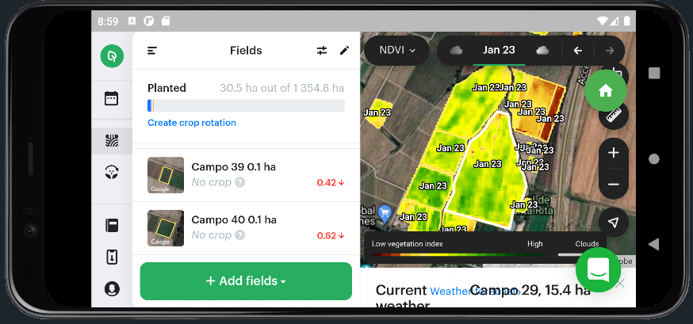

# flutter2_sdk32_navegador

## Generalidades.

### autor: reruiz@inia.cl.

El actual proyecto utiliza el paquete flutter_inappwebview (5.3.2)
https://pub.dev/packages/flutter_inappwebview. InAppWebView es un widget de Flutter para agregar un WebView nativo en el árbol de widgets de Flutter.

El complemento se basa en el mecanismo de Flutter para incorporar vistas nativas de Android e iOS: AndroidView y UiKitView, (el actual proyecto es una modificación del ejemplo https://inappwebview.dev/docs/in-app-webview/basic-usage/)

Una característica importante del proyecto actual, es que permite realizar zoom sobre la página visitada.

El actual proyecto en su última versión se dirige a la página de la plataforma desarrollada por la empresa onesoil (https://app.onesoil.ai/?utm_source=website&utm_medium=menu_es'). En donde las claves de acceso son: sbest@inia.cl:Cotebenja1

## Creación de una APK.

La siguiente documentación puede ser encontrada en: https://docs.flutter.dev/deployment/android

* Ingresar al directorio de la app (ejem: "C:\Users\Esteban\Desktop\flutter2_sdk32_navegador")
* Ejecutar comando ***flutter build apk --split-per-abi***
* Este comando da como resultado tres archivos APK:
    - [project]/build/app/outputs/apk/release/app-armeabi-v7a-release.apk
    - [project]/build/app/outputs/apk/release/app-arm64-v8a-release.apk
    - [project]/build/app/outputs/apk/release/app-x86_64-release.apk

* Observación: Quitar la etique ***--split-per-abi*** da como resultado un APK voluminoso que contiene su código compilado para todas las ABI de destino. Dichos APK son más grandes que sus contrapartes divididas, lo que hace que el usuario descargue binarios nativos que no son aplicables a la arquitectura de su dispositivo.

## Instalación de una APK.

Una vez concluidos los pasos anteriores, realizar los siguientes pasos:

* Conecte su dispositivo Android a su computadora con un cable USB.
* Ingresar al directorio de la app (ejem: "C:\Users\Esteban\Desktop\flutter2_sdk32_navegador")
* Ejecutar comando ***flutter install***.

#

**Figura 1.** Aplicación completamente funcional a requerimientos iniciales (v.2.0.0)
