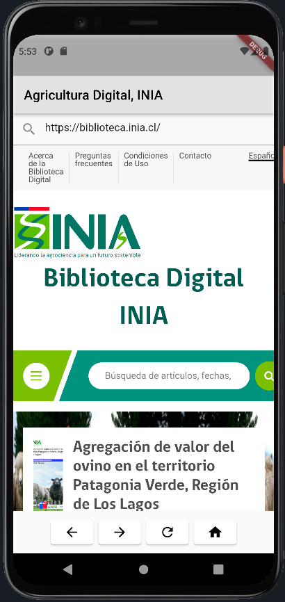

# flutter2_sdk32_navegador

El actual proyecto utiliza el paquete flutter_inappwebview (5.3.2)
https://pub.dev/packages/flutter_inappwebview

InAppWebView es un widget de Flutter para agregar un WebView nativo en el árbol de widgets de Flutter.

El complemento se basa en el mecanismo de Flutter para incorporar vistas nativas de Android e iOS: AndroidView y UiKitView.

El actual proyecto es una modificación del ejemplo https://inappwebview.dev/docs/in-app-webview/basic-usage/

Una característica importante del proyecto actual, es que permite realizar zoom sobre la página visitada

#

**Figura 1.** Vista general de la aplicación (v.1.0.0)

